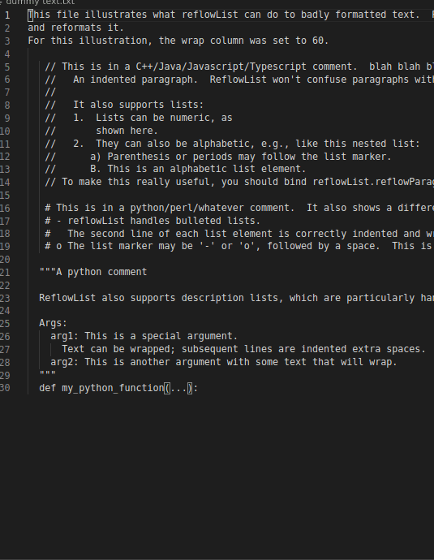

# reflowlist

reflowList is an extension for reflowing (wrapping) text that might have lists,
whether numeric lists, bulleted lists, or definition lists. It correctly
handles comments in most languages. It is designed primarily for reflowing
comments in code.

## Features

reflowList provides a single command, `reflowlist.reflowParagraph`, which does
the reformatting.

`reflowParagraph` reformats the paragraph around the cursor, where "paragraph"
is defined as lines that have a common prefix and the same indentation.

reflowlist understands bulleted lists (marked by '-' or 'o'), numbered or
lettered lists ("1.", "a.", "1)", "a)"), and definition lists. If the list
element extends more than one line, the subsequent lines are indented properly.

This is best shown by example:



## Extension Settings

If you need to support other programming languages or other definitions, you can
adjust the regular expressions that reflowList uses to find comments. The
regular expressions or wrap columns can be changed on a per-language or
per-workspace basis following the usual vscode conventions.

You can adjust the regular expressions that reflowlist uses to find comments and
lists and definition lists. You can also adjust the `wrapColumn` (the column at
which text is wrapped). (This is how the above examples were formatted.)

## Known Issues

* reflowList may incorrectly think that a line that begins with a word followed
  by a colon is the first line of a definition list. This is a hazard of
  supporting definition lists; it was not obvious how to make it support
  definition lists without occasionally seeing them in the wrong place. You may
  have to fix up such paragraphs manually.

* reflowList does not support paragraphs where the first line is indented or
  out-dented; it assumes that any lines with different indentation belong to a
  different paragraph. This is normally what you want when editing code or
  markdown.

* reflowList converts tabs into spaces. Sorry if you actually wanted hard tabs.
  Hopefully you have a code reformatted (like gofmt) that can convert back.

* reflowList does not attempt to reflow /* comment */ lines where there is text
  on the opening line of the comment, e.g.,

  ```
  /* Some text
   * that needs reflowing */
  ```

  It will treat the first line as a separate paragraph from subsequent lines.
  You may have to fix such comments manually.

  However, it will correctly reflow multi-line /* comment */ where there is no
  text on the opening line, e.g.,

  ```
  /*
   * Some text
   * that needs reflowing
   */
  ```


## Release Notes

### 0.5

Initial release.
